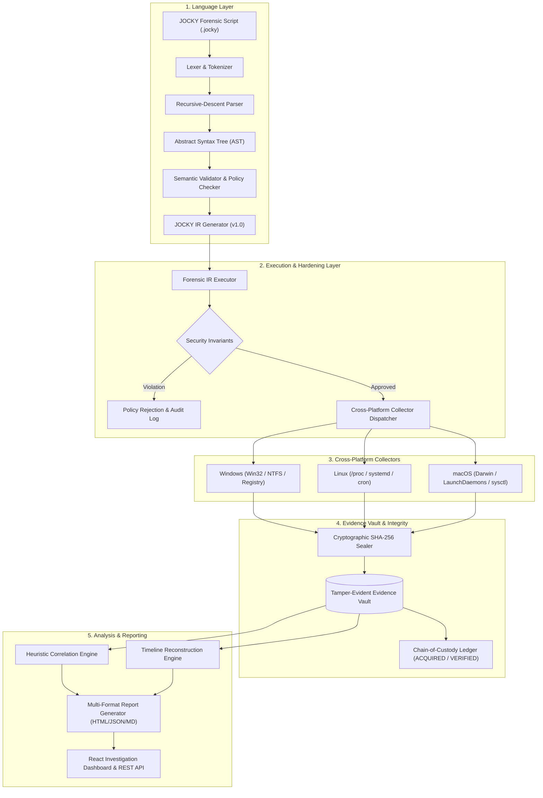

# JOCKY — Domain-Specific Forensic Analysis Framework

> **Smart India Hackathon (SIH) 2026 — Problem Statement SIH26148**  
> *"Creation of scripts/functions with new programming language to commence Computer & Network forensic analysis without triggering security solutions."*

[](https://YOUR-APP-NAME.onrender.com)
[](tests/)
[](https://fastapi.tiangolo.com)
[](https://react.dev)
[](https://www.python.org/)
[](backend/app/collectors/)
[](Dockerfile)

---

## 🌐 Live Application & Demo

> **Live Application URL**: `https://YOUR-APP-NAME.onrender.com`  
> *(Replace `YOUR-APP-NAME` with your free Render app deployment name)*

The repository contains a multi-stage Docker build that bundles the React dashboard and FastAPI backend into a single container running seamlessly on port `8000`.

---

## 📑 Table of Contents

- [Executive Summary](#-executive-summary)
- [Compliance & Scope Statement](#-compliance--scope-statement)
- [Key Features](#-key-features)
- [System Architecture](#-system-architecture)
- [JOCKY Domain-Specific Language (DSL)](#-jocky-domain-specific-language-dsl)
  - [Grammar & Syntax](#grammar--syntax)
  - [Example Scripts](#example-scripts)
- [Core Subsystems](#-core-subsystems)
  - [1. Language & Compiler Engine](#1-language--compiler-engine)
  - [2. Policy & Hardened Execution Engine](#2-policy--hardened-execution-engine)
  - [3. Cross-Platform Safe Collectors](#3-cross-platform-safe-collectors)
  - [4. Evidence Vault & Chain of Custody](#4-evidence-vault--chain-of-custody)
  - [5. Heuristic Analysis & Timeline Engine](#5-heuristic-analysis--timeline-engine)
  - [6. Multi-Format Forensic Reporting](#6-multi-format-forensic-reporting)
  - [7. Security, RBAC & AI Analyst Assistant](#7-security-rbac--ai-analyst-assistant)
  - [8. React Web Dashboard](#8-react-web-dashboard)
- [CLI Runner (`jocky.py`)](#-cli-runner-jockypy)
- [REST API Reference](#-rest-api-reference)
- [Repository Structure](#-repository-structure)
- [Getting Started](#-getting-started)
  - [Prerequisites](#prerequisites)
  - [Backend Setup](#backend-setup)
  - [Frontend Setup](#frontend-setup)
  - [Running Backend Tests](#running-backend-tests)
- [Deployment Guide](#-deployment-guide)
  - [Option 1: 1-Click Render Deployment (Free)](#option-1-1-click-render-deployment-free)
  - [Option 2: Docker Unified Container](#option-2-docker-unified-container)
- [Security Disclaimer](#-security-disclaimer)

---

## 🔬 Executive Summary

During digital forensics and incident response (DFIR) engagements, security incident responders often face an acute dilemma: standard administrative command-line scripts (e.g., PowerShell loops, aggressive WMI polling, or ad-hoc binaries) frequently trigger false-positive alarms on Antivirus (AV) and Endpoint Detection & Response (EDR) agents. This alert fatigue disrupts legitimate investigations and pollutes telemetry.

**JOCKY** resolves this fundamental challenge through an **authorized, declarative Domain-Specific Language (DSL)** coupled with a **hardened, read-only collection engine**. Instead of relying on stealth, process injection, or evasion tricks that characterize malicious malware, JOCKY minimizes endpoint friction by design:
1. **Declarative Read-Only Constraints**: The DSL strictly prohibits memory manipulation, destructive file writes, and process injection.
2. **Transparent Standard Telemetry**: Standard operating system APIs (`psutil`, `/proc`, `sysctl`, Win32 read APIs) are utilized deterministically.
3. **Cryptographic Sealing**: Every acquired artifact is hashed with SHA-256 at collection time and registered into an immutable legal chain-of-custody ledger.
4. **Rate-Limited Non-Disruptive Execution**: System inspection operations are throttled to prevent resource spikes that flag behavioral heuristics.

---

## ⚠️ Compliance & Scope Statement

**JOCKY is an authorized digital-forensics and incident response research framework.**

In strict adherence to ethical, lawful, and defensive cybersecurity standards:
- **NO Anti-Analysis or Evasion**: JOCKY explicitly avoids rootkits, bootkits, Bring Your Own Vulnerable Driver (BYOVD) exploitation, process hollowing, memory injection, covert C2, or disabling AV/EDR hooks.
- **Transparent Authorization**: Execution requires valid operator clearance, session tokens, and strict policy boundary validation (e.g., strict directory sandboxing and path-traversal prevention).
- **Audit Transparency**: All execution events, policy checks, user logins, and evidence queries generate immutable audit log records.

---

## ✨ Key Features

- **Domain-Specific Language (DSL)**: Concise, human-readable forensic scripting syntax (`CASE`, `TARGET`, `COLLECT`, `WHERE`, `ANALYZE`, `VERIFY INTEGRITY`, `REPORT`).
- **Full Compiler Pipeline**: Tokenizer (Lexer), Abstract Syntax Tree (AST) builder, Semantic Validator, and Intermediate Representation (IR) emitter.
- **Cross-Platform Telemetry**: Dedicated, schema-normalized collectors for **Windows**, **Linux**, and **macOS** (processes, open sockets, system metadata, user accounts, and autorun/persistence artifacts).
- **Tamper-Evident Evidence Vault**: Cryptographic SHA-256 evidence sealing with mathematical tamper detection and automated vault-wide integrity verification.
- **Legal Chain of Custody**: Immutable audit trail documenting *who*, *what*, *when*, *why*, and *hash verification* for every forensic artifact.
- **Forensic Correlation & Timeline**: Correlates socket listeners with process trees, detects abnormal execution locations (e.g., `/tmp`, `AppData\Local\Temp`), and reconstructs chronological timelines.
- **Multi-Format Forensic Dossiers**: Auto-generates structured JSON, printable HTML, and Markdown reports featuring executive summaries, anomaly severity, and MITRE ATT&CK tags.
- **Security & AI Assistance**: Role-Based Access Control (RBAC), password hashing via PBKDF2, analyst collaboration channel, and Gemini-powered AI forensic guidance.
- **Investigator Web Dashboard**: Modern React 18 interface with an in-browser script editor, visual evidence explorer, live metrics, and incident triage alerts.
- **Unified Master CLI (`jocky.py`)**: Powerful command-line tool supporting standalone compilation, script execution, vault audits, and evidence bundle exports.

---

## 🏛 System Architecture

The following diagram illustrates the complete JOCKY forensic analysis and evidence custody pipeline:



---

## 💻 JOCKY Domain-Specific Language (DSL)

### Grammar & Syntax

A JOCKY script begins with required case and target headers, followed by safe collection, filtering, analysis, integrity verification, and reporting directives:

| Keyword | Description | Example |
|---|---|---|
| `CASE` | Uniquely identifies the investigation docket | `CASE "INCIDENT-2026-004"` |
| `TARGET` | Designates the target machine hostname or IP | `TARGET "SERVER-CORP-01"` |
| `COLLECT` | Gathers read-only forensic telemetry (`SYSTEM`, `PROCESSES`, `NETWORK`, `FILES`, `USERS`, `REGISTRY`, `WINDOWS_METADATA`) | `COLLECT PROCESSES` |
| `WHERE` | Post-collection filter clause | `COLLECT NETWORK WHERE STATE == ESTABLISHED` |
| `ANALYZE` | Triggers anomaly detection and cross-source correlation | `ANALYZE` or `ANALYZE PROCESS_NETWORK` |
| `VERIFY INTEGRITY` | Recomputes and validates SHA-256 hashes against the custody ledger | `VERIFY INTEGRITY` |
| `REPORT` | Produces forensic dossiers in structured or formatted output | `REPORT FORMAT JSON` or `REPORT` |

### Example Scripts

#### Full System & Network Triage (`examples/sample.jocky`)
```jocky
# Authorized JOCKY Forensic Script
CASE "LAB-2026-001"
TARGET "LAB-PC"

COLLECT SYSTEM
COLLECT PROCESSES WHERE STATUS == RUNNING
COLLECT NETWORK WHERE STATE == ESTABLISHED
COLLECT FILES "./evidence"

ANALYZE
VERIFY INTEGRITY
REPORT
```

#### Syntax Error Detection (`examples/invalid.jocky`)
The compiler validates syntax and strictly rejects unauthorized or destructive operations:
```jocky
CASE "LAB-2026-INVALID"
TARGET "LAB-PC"

# Compiler Error: 'INJECT' is an illegal, non-forensic command
INJECT MALWARE
```

---

## 🧩 Core Subsystems

### 1. Language & Compiler Engine
Located in `backend/app/language/`:
- **`lexer.py`**: High-performance tokenizer mapping keywords, strings, integers, and operators while recording precise line and column numbers.
- **`parser.py`**: Recursive-descent parser producing strongly typed AST nodes (`CaseNode`, `TargetNode`, `CollectNode`, `FilterNode`, `AnalyzeNode`, `VerifyNode`, `ReportNode`).
- **`validator.py`**: Semantic validation layer verifying structural integrity (mandatory `CASE` and `TARGET`, valid filter targets, directory traversal prevention).
- **`ir.py` & `compiler.py`**: Emits declarative, portable JOCKY Intermediate Representation (IR v1.0) consumed by the execution runtime.

### 2. Policy & Hardened Execution Engine
Located in `backend/app/engine/`:
- **`ir_policy.py` & `policy.py`**: Restricts forensic operations to read-only semantics. Prevents path traversal (`../`), write actions, and unapproved filesystem access.
- **`ir_executor.py` & `executor.py`**: Coordinates sequential and concurrent task execution, telemetry capture, and error boundary isolation.
- **`hardening.py`**: Enforces process memory isolation, execution timeouts, rate limits, and safe system handle reclamation.

### 3. Cross-Platform Safe Collectors
Located in `backend/app/collectors/`:
- **`dispatcher.py`**: Auto-detects runtime OS (`Windows`, `Linux`, or `Darwin`) and dispatches to native collector implementations with 100% schema consistency.
- **`system.py` / `linux_collectors.py` / `macos_collectors.py`**: Gathers hardware details, kernel versions, boot time, memory limits, and CPU architecture.
- **`processes.py`**: Enumerates running tasks, PID/PPID hierarchy, parent process names, command-line arguments, and memory footprints via read-only APIs (`psutil`).
- **`network.py`**: Inspects listening sockets, established TCP/UDP connections, bound interfaces, and port-to-PID mappings without packet injection.
- **`files.py`**: Recursively enumerates targeted evidence paths collecting file sizes, permission bits, MAC timestamps (Modified, Accessed, Created), and SHA-256 hashes.
- **`users.py`**: Enumerates system user accounts, login history, and elevated group memberships.
- **`windows_metadata.py`**: Gathers autorun registry entries, scheduled tasks, and persistence indicators.

### 4. Evidence Vault & Chain of Custody
Located in `backend/app/evidence/`:
- **`vault.py`**: Isolates collected forensic artifacts into structured case repositories (`evidence/vault/cases/<CASE-ID>/`).
- **`hashing.py`**: Cryptographically computes SHA-256 digests over raw payload bytes at the millisecond of acquisition.
- **`custody.py`**: Maintains immutable custody logs tracking `ACQUIRED`, `VERIFIED`, `ACCESSED`, `EXPORTED`, and `TAMPER_DETECTED` events with investigator ID and timestamps.
- **Tamper Detection**: On-demand integrity audit recomputes the SHA-256 hash of every stored JSON artifact against its custody record, flagging any unauthorized disk alteration.
- **Cryptographic Export**: Packages evidence cases into signed `.zip` archives containing an integrity manifest and root hash.

### 5. Heuristic Analysis & Timeline Engine
Located in `backend/app/analysis/`:
- **`correlator.py`**: Links network connections to originating process PIDs; detects processes executing from suspicious locations (e.g., temporary directories, appdata) or anomalous parent-child chains (e.g., `cmd.exe` spawned by office suites).
- **`timeline.py`**: Aggregates disparate timestamps across file changes, process launches, and network events into a unified chronological event timeline.
- **`rules.py`**: Implements forensic detection rules mapped against MITRE ATT&CK techniques with severity classifications (`LOW`, `MEDIUM`, `HIGH`, `CRITICAL`).

### 6. Multi-Format Forensic Reporting
Located in `backend/app/reporting/`:
- **`report_engine.py`**: Compiles evidence, analysis findings, anomalies, and integrity audit results into multi-format dossiers:
  - **HTML**: Styled, print-ready forensic dossiers suitable for executive briefings and court submissions.
  - **JSON**: Complete, machine-readable structured format for SIEM ingestion.
  - **Markdown**: Formatted textual summaries for incident tickets and git tracking.

### 7. Security, RBAC & AI Analyst Assistant
Located in `backend/app/security/`:
- **Authentication & RBAC**: Operator authentication using PBKDF2-SHA256 password hashing and secure token-based sessions. Supports distinct roles (`Lead Forensic Examiner`, `Incident Responder`, `SOC Incident Commander`).
- **AI Forensic Assistant (`ai_provider.py`)**: Integrated AI advisory channel powered by the Google Gemini API to assist examiners with hypothesis generation and artifact queries.
- **Analyst Chat & Queue (`report_queue.py`)**: Real-time communication bridge between field examiners and SOC analysts, featuring an offline report queue with automatic retries.
- **Immutable Audit Logging (`audit.py`)**: Tamper-resistant chronological recording of logins, script executions, evidence verifications, and report dispatches.

### 8. React Web Dashboard
Located in `frontend/`:
- Built with **React 18**, **Vite**, and responsive modern CSS.
- **Investigation Console**: Interactive JOCKY script editor with pre-loaded templates, AST inspector, and live execution triggers.
- **Evidence Vault Explorer**: Visual browser for acquired artifacts, displaying real-time SHA-256 verification badges and tampering status.
- **Incident Alerting**: Banner alerts for critical security incidents with triage guidance.
- **AI Cyber Support**: Embedded real-time chat with the AI forensic assistant or online SOC analysts.
- **Report Generation**: Interactive viewer for generated HTML, Markdown, and JSON forensic reports.

---

## ⌨️ CLI Runner (`jocky.py`)

JOCKY provides a master executable at the project root for headless environments and automated CI/CD workflows:

```bash
# 1. Compile & validate a JOCKY DSL script
python jocky.py compile examples/sample.jocky

# 2. Execute a forensic script and generate a report
python jocky.py execute examples/sample.jocky --format HTML --output reports/investigation.html

# 3. Perform a cryptographic integrity audit of the entire Evidence Vault
python jocky.py audit

# 4. Audit a specific case
python jocky.py audit --case LAB-2026-001

# 5. Export a cryptographically sealed evidence bundle with manifest
python jocky.py export LAB-2026-001 --output exports/LAB-2026-001-bundle.zip

# 6. Launch the FastAPI server locally
python jocky.py serve --port 8000
```

---

## 📡 REST API Reference

The backend exposes a comprehensive RESTful API for automation and frontend integration:

| Method | Endpoint | Description |
|---|---|---|
| `GET` | `/api/health` | Service health status and version verification |
| `POST` | `/api/jocky/compile` | Compiles source text, returning tokens, AST, and IR |
| `POST` | `/api/jocky/validate` | Validates syntax and policy compliance without execution |
| `POST` | `/api/jocky/execute` | Executes a JOCKY script end-to-end and returns findings |
| `POST` | `/api/jocky/investigate` | One-shot execution, analysis, and report generation |
| `GET` | `/api/forensics/collectors` | Lists available collectors and active OS platform |
| `GET` | `/api/forensics/collect/{source}` | Collects telemetry on-demand (`system`, `processes`, `network`, `users`) |
| `GET` | `/api/forensics/vault/list` | Lists all sealed artifacts across evidence cases |
| `GET` | `/api/forensics/vault/artifact/{id}` | Retrieves a sealed artifact and its chain of custody |
| `POST` | `/api/forensics/vault/seal` | Manually seals an evidence artifact with SHA-256 |
| `POST` | `/api/forensics/vault/verify` | Cryptographically verifies a specific artifact's hash |
| `GET` | `/api/forensics/vault/audit` | Performs a full-vault cryptographic integrity audit |
| `GET` | `/api/forensics/vault/export/{case_id}` | Downloads a signed evidence archive with manifest |
| `GET` | `/api/forensics/correlate` | Cross-correlates processes with network activity |
| `GET` | `/api/forensics/timeline` | Generates a chronological forensic event timeline |
| `POST` | `/api/forensics/report` | Generates an investigation report (JSON / HTML / MD) |
| `POST` | `/api/auth/login` | Investigator login and session token issuance |
| `POST` | `/api/auth/register` | Registers a new forensic operator |
| `POST` | `/api/security/chat` | Interacts with the forensic analyst or AI assistant |
| `GET` | `/api/security/audit` | Retrieves the chronological security audit log |

Interactive Swagger documentation is available at `http://localhost:8000/docs`.

---

## 📂 Repository Structure

```
jocky-forensics/
├── backend/
│   ├── app/
│   │   ├── analysis/             # Forensic correlation, rules & timeline reconstruction
│   │   │   ├── correlator.py     # Process-to-network socket correlation
│   │   │   ├── rules.py          # MITRE ATT&CK-aligned heuristic detection rules
│   │   │   └── timeline.py       # Chronological event timeline synthesizer
│   │   ├── collectors/           # Cross-platform safe read-only collectors
│   │   │   ├── dispatcher.py     # Cross-platform abstraction router (Windows/Linux/macOS)
│   │   │   ├── files.py          # Read-only file metadata & SHA-256 collector
│   │   │   ├── linux_collectors.py   # Linux /proc, /etc, systemd, crontab collectors
│   │   │   ├── macos_collectors.py   # macOS LaunchDaemons, LaunchAgents, sysctl
│   │   │   ├── network.py        # Sockets, interfaces & listening ports
│   │   │   ├── processes.py      # Process trees, command lines, memory metrics
│   │   │   ├── system.py         # Hardware, OS release, uptime & platform specs
│   │   │   ├── users.py          # User accounts, privileges & login sessions
│   │   │   └── windows_metadata.py   # Registry autoruns & Windows metadata
│   │   ├── engine/               # Policy enforcement & task execution
│   │   │   ├── executor.py       # Sequential & concurrent execution coordinator
│   │   │   ├── hardening.py      # Resource rate-limiting & sandbox boundaries
│   │   │   ├── ir_executor.py    # JOCKY Intermediate Representation executor
│   │   │   ├── ir_policy.py      # IR-level security and permission validator
│   │   │   └── policy.py         # Read-only and directory allowlist policies
│   │   ├── evidence/             # Cryptographic evidence vault & custody ledger
│   │   │   ├── custody.py        # Legal Chain of Custody ledger models
│   │   │   ├── hashing.py        # SHA-256 cryptographic primitives
│   │   │   ├── store.py          # Evidence repository index & persistence
│   │   │   └── vault.py          # Tamper-evident vault, audit & export engine
│   │   ├── language/             # JOCKY DSL compiler subsystem
│   │   │   ├── ast.py            # Typed Abstract Syntax Tree nodes
│   │   │   ├── compiler.py       # Full compilation entry point
│   │   │   ├── errors.py         # Lexical, syntax, and validation exceptions
│   │   │   ├── ir.py             # JOCKY Intermediate Representation (IR v1.0)
│   │   │   ├── lexer.py          # Lexical scanner and tokenizer
│   │   │   ├── parser.py         # Recursive-descent grammar parser
│   │   │   ├── tokens.py         # Token definitions and keyword mappings
│   │   │   └── validator.py      # Semantic AST validator and execution planner
│   │   ├── reporting/            # Multi-format report synthesis
│   │   │   └── report_engine.py  # Generates HTML dossiers, JSON, and Markdown
│   │   ├── security/             # Authentication, RBAC, AI Analyst & Audit
│   │   │   ├── ai_provider.py    # Google Gemini AI forensic advisor integration
│   │   │   ├── analyst.py        # Human analyst status & chat coordinator
│   │   │   ├── audit.py          # Immutable chronological audit logging
│   │   │   ├── auth.py           # PBKDF2 password hashing & token sessions
│   │   │   ├── incident.py       # Real-time incident triage models
│   │   │   ├── report_queue.py   # Secure queue for off-line analyst delivery
│   │   │   └── routes.py         # Security & incident response REST endpoints
│   │   ├── cli.py                # Command-line interface logic
│   │   └── main.py               # FastAPI application entrypoint & static mount
│   └── requirements.txt          # Python dependencies
├── frontend/                     # React 18 + Vite investigative dashboard
│   ├── src/
│   │   ├── App.jsx               # Main investigative portal & console
│   │   ├── CommandSearch.jsx     # Quick command & search palette
│   │   ├── CriticalIncidentAlert.jsx # Incident notification banner
│   │   ├── CyberSupport.jsx      # Live analyst & AI support panel
│   │   ├── InvestigatorDashboard.jsx # Case overview & metrics widgets
│   │   ├── Login.jsx             # Secure clearance authentication modal
│   │   ├── ReportModal.jsx       # Multi-format report viewer & exporter
│   │   ├── Sidebar.jsx           # Dashboard navigation sidebar
│   │   ├── api.js                # Frontend API client
│   │   └── index.css             # Cyber forensic design styling
│   ├── package.json              # Frontend npm dependencies
│   ├── vite.config.js            # Vite configuration & proxy settings
│   └── vercel.json               # Vercel deployment configuration
├── examples/                     # Sample JOCKY forensic scripts
│   ├── sample.jocky              # Valid end-to-end workflow script
│   └── invalid.jocky             # Malformed script for error detection testing
├── tests/                        # Comprehensive test suite (256 test cases)
│   ├── test_backend.py           # FastAPI endpoints & health checks
│   ├── test_collectors.py        # Read-only telemetry collectors
│   ├── test_correlator.py        # Process-to-network socket correlation
│   ├── test_cross_platform.py    # Windows, Linux, and macOS dispatcher parity
│   ├── test_dsl_phase1.py        # Lexer, parser, AST, IR & validator tests
│   ├── test_engine.py            # Execution engine & task scheduling
│   ├── test_evidence.py          # Evidence storage & retrieval
│   ├── test_hardening.py         # Sandbox enforcement & resource limits
│   ├── test_parser.py            # Grammar and syntax error reporting
│   ├── test_reporting.py         # HTML/JSON/Markdown report synthesis
│   ├── test_security_workflow.py # RBAC, chat, AI fallback & audit logs
│   ├── test_timeline.py          # Event timeline reconstruction
│   └── test_vault.py             # SHA-256 sealing, tampering detection & export
├── architecture.md               # Architectural blueprint & specification
├── Dockerfile                    # Multi-stage production container build
├── jocky.py                      # Master executable CLI script
├── render.yaml                   # Infrastructure-as-code for Render deployment
└── README.md                     # Project documentation & guidelines
```

---

## 🚀 Getting Started

### Prerequisites

- **Python**: 3.10, 3.11, or 3.12
- **Node.js**: 18.x or later (for building the frontend)
- **Git**

### Backend Setup

1. **Clone the repository**:
   ```bash
   git clone https://github.com/MuzraFatima/jocky-forensics.git
   cd jocky-forensics
   ```

2. **Create and activate a virtual environment**:
   ```bash
   # Windows PowerShell
   python -m venv venv
   .\venv\Scripts\Activate.ps1

   # Linux / macOS
   python3 -m venv venv
   source venv/bin/activate
   ```

3. **Install Python dependencies**:
   ```bash
   cd backend
   pip install -r requirements.txt
   cd ..
   ```

4. **Start the backend development server**:
   ```bash
   python jocky.py serve --port 8000
   ```
   - API Root: `http://127.0.0.1:8000/api`
   - Interactive Docs: `http://127.0.0.1:8000/docs`

### Frontend Setup

1. **Navigate to the frontend directory**:
   ```bash
   cd frontend
   ```

2. **Install dependencies**:
   ```bash
   npm install
   ```

3. **Start the Vite dev server**:
   ```bash
   npm run dev
   ```
   - Dashboard: `http://localhost:5173` (proxies `/api` requests to backend at port 8000)

---

### Running Backend Tests

The project includes an automated test suite containing **256 unit and integration test cases** covering every subsystem:

```bash
# Run all tests from the repository root
python -m pytest tests/ -v
```

Test coverage includes:
- JOCKY DSL Lexer, Parser, AST, Validator, and IR Generation
- Cross-platform safe telemetry collectors (Windows, Linux, macOS)
- Cryptographic SHA-256 artifact sealing and mathematical tamper detection
- Process-to-socket correlation and heuristic anomaly detection
- Multi-format report generation (JSON, HTML, Markdown)
- RBAC authentication, session revocation, AI assistant querying, and audit logging

---

## 🚢 Deployment Guide

### Option 1: 1-Click Render Deployment (Free)

The project includes a root `Dockerfile` and `render.yaml` enabling deployment to [Render](https://render.com) with zero manual server configuration:

1. Push this repository to your GitHub account:
   ```bash
   git push origin main
   ```
2. Log in to [Render.com](https://render.com) and click **New +** > **Web Service**.
3. Select your `jocky-forensics` repository.
4. Set the runtime environment to **Docker** (it automatically detects the root `Dockerfile`).
5. Choose the **Free** instance type.
6. Click **Create Web Service**.
7. Render will build the React frontend, package the FastAPI backend, and provide a public HTTPS URL:
   `https://<your-service-name>.onrender.com`
8. Update the `[Live Demo]` badge at the top of this `README.md` with your new live URL!

### Option 2: Docker Unified Container

Build and run the entire unified stack locally in a single Docker container:

```bash
# Build the multi-stage image
docker build -t jocky-forensics .

# Run the container mapping port 8000
docker run -d -p 8000:8000 --name jocky-app jocky-forensics
```

Open `http://localhost:8000` in your browser to access the complete application.

---

## 🛡 Security Disclaimer

JOCKY is an academic and defensive cybersecurity research project developed for authorized digital forensic examination, incident response, and educational purposes.

- JOCKY **does not** contain exploit payloads, rootkits, shellcode, evasion modules, or unauthorized penetration testing tools.
- All collection modules operate in strict read-only mode using standard operating system APIs.
- Users must ensure they have explicit, documented authorization from system owners prior to running forensic collections in production environments.
