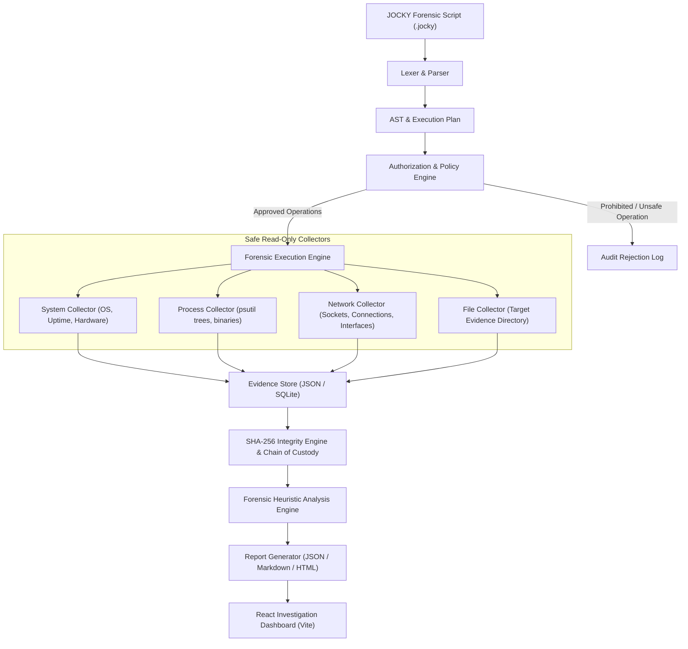

# JOCKY — Domain-Specific Forensic Analysis Framework
## Architecture Specification & Design Blueprint (SIH26148)

---

## 1. System Overview

**JOCKY** is a specialized, domain-specific forensic analysis framework engineered for authorized digital investigation teams. It provides a human-readable, declarative Domain-Specific Language (DSL) that standardizes how forensic artifacts (system state, active processes, network configurations, and controlled files) are collected, hashed, verified, analyzed, and presented.

### Critical Scope & Security Principles
* **Authorized Read-Only Forensics**: JOCKY is explicitly designed for administrative, lawful, and authorized incident response and forensic collection.
* **No Evasion / No Bypass**: The framework strictly rejects and does not implement antivirus/EDR bypass, memory injection, covert persistence, rootkits, bootkits, stealth hooking, or security control termination.
* **Deterministic Auditability**: Every operation is logged, policy-checked, hashed using cryptographic primitives (SHA-256), and anchored to an auditable chain of custody.

---

## 2. End-to-End Pipeline Architecture

---

## 3. Component Architecture Breakdown

### 3.1 Language Subsystem (`backend/app/language/`)
- **Lexer**: Scans JOCKY scripts into tokens (`CASE`, `TARGET`, `COLLECT`, `ANALYZE`, `VERIFY`, `REPORT`, literals, strings).
- **Parser**: Builds a typed Abstract Syntax Tree (AST) validating grammatical structure.
- **Execution Plan Generator**: Emits a deterministic, validated sequence of tasks with defined parameters and scope.

### 3.2 Policy & Execution Engine (`backend/app/engine/`)
- **Policy Engine**: Validates target paths against allowlists, forbids path traversal (`../`), verifies investigator credentials, and enforces non-destructive invariants.
- **Execution Engine**: Executes tasks concurrently or sequentially, tracking operational status, progress, and telemetry without side-effects on target systems.

### 3.3 Forensic Collectors (`backend/app/collectors/`)
- **System Collector**: Gathers kernel version, OS release, platform, uptime, system load.
- **Process Collector**: Enumerates process IDs, executable paths, parent PID hierarchies, command lines, memory metrics using standard read-only APIs (`psutil`).
- **Network Collector**: Discovers open ports, established TCP/UDP connections, listening sockets, and network interface configurations.
- **Controlled File Collector**: Collects file size, timestamps (MAC times: Modified, Accessed, Created), and file metadata strictly within the configured evidence target directory.

### 3.4 Evidence Store & Chain of Custody (`backend/app/evidence/`)
- **Evidence Store**: Persists acquired raw data in structured, tamper-evident formats (JSON / SQLite).
- **Integrity Manager**: Calculates SHA-256 digest at collection time and verifies hashes upon demand (`VERIFY INTEGRITY`).
- **Chain of Custody Ledger**: Records timestamp (UTC), operator identity, machine ID, script hash, and artifact signatures for legal admissibility.

### 3.5 Heuristic Analysis Engine (`backend/app/analysis/`)
- Analyzes collected artifacts against forensic heuristics:
  - Anomalous process locations (e.g. executables running from temporary directories).
  - Suspicious parent-child process relationships (e.g. office applications spawning shell interpreters).
  - Non-standard network listening ports or anomalous external connection patterns.
  - File entropy and hash discrepancy flags.

### 3.6 Reporting & Presentation Subsystem (`backend/app/reports/` & `frontend/`)
- **Report Engine**: Exports multi-format audit reports (JSON schema, printable Markdown/HTML).
- **React/Vite Dashboard**: Provides a unified interface for investigators:
  - Script editor with syntax feedback.
  - Live execution plan monitoring.
  - Evidence artifact explorer with SHA-256 verification badges.
  - Incident timeline and forensic findings overview.

---

## 4. Implementation Phasing

| Phase | Focus | Status |
|---|---|---|
| **Phase 1 (Current)** | Clean project skeleton, FastAPI health service, React/Vite dashboard shell, architecture specs, and test harness | **Complete** |
| **Phase 2 (Next)** | JOCKY Lexer, Parser, AST generator, and Authorization Policy Engine | Planned |
| **Phase 3** | Safe Collectors (`psutil`), Evidence Store, SHA-256 verification, and Chain of Custody | Planned |
| **Phase 4** | Heuristic Analysis Engine, Report generation, and full React dashboard integration | Planned |
